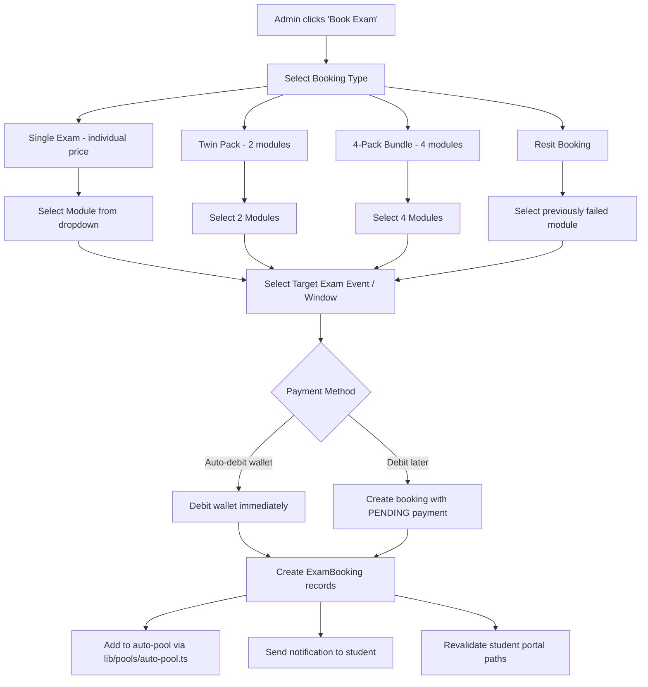

# Student Management Hub — Architecture Plan

## Overview

Create a comprehensive **Student Detail Page** at `/staff/students/[id]` that serves as a single hub for admins to view and manage everything about a student: profile, exams (passed/failed/resit/upcoming), exam bookings (single/twin/4-pack), wallet, enrollments, and more — all from one page. Every change reflects instantly on the student's portal.

## Current State vs Proposed

| Feature               | Current                             | Proposed                                                         |
| --------------------- | ----------------------------------- | ---------------------------------------------------------------- |
| Student info          | Read-only side panel                | Full page with inline edit dialogs                               |
| Exam history          | Basic list (read-only)              | Filterable table with pass/fail/resit/upcoming + edit/add/delete |
| Exam booking by admin | Only via generic Records tab        | Dedicated dialog per student with bundle options                 |
| Wallet management     | Balance display + manual adjustment | Full transaction history + adjustment + auto-debit on booking    |
| Enrollments           | Simple list                         | Editable with grades rollup                                      |
| Navigation            | Side panel only                     | Side panel → "View Full Profile" link → dedicated page           |

---

## Architecture Diagram

```mermaid
flowchart TD
    A[StudentsTable - split panel list] -->|Click student row| B[StudentDetailPanel - quick preview]
    B -->|Click 'View Full Profile'| C[/staff/students/id - Full Detail Page]
    A -->|Click student name link| C

    C --> D[Profile Tab]
    C --> E[Exams Tab]
    C --> F[Wallet Tab]
    C --> G[Academic Tab]

    D --> D1[EditProfileDialog - reuse existing]
    D --> D2[EditPathwayDialog - reuse existing]
    D --> D3[EditAcademicPeriodDialog - reuse existing]
    D --> D4[EditIdDialog - reuse existing]

    E --> E1[ExamHistoryTable - filterable: passed/failed/resit/upcoming/all]
    E --> E2[AddExamRecordDialog - manual record entry]
    E --> E3[EditExamRecordDialog - inline edit existing records]
    E --> E4[BookExamForStudentDialog - single/twin/4-pack/resit]

    E4 -->|Auto-debit wallet| WalletOps
    E4 -->|Debit later flag| ManualDebit

    F --> F1[Balance Cards - available/reserved/total]
    F --> F2[WalletTransactionsTable - full history with filters]
    F --> F3[ManualWalletAdjustmentDialog - reuse existing]

    G --> G1[EnrollmentsList with grades summary]
    G --> G2[AttendanceRecords]
    G --> G3[OjtSection - for full-time students]

    WalletOps[lib/wallet/operations.ts]
    ManualDebit[ExamBooking created with PENDING status]
```

---

## File Structure

```
app/staff/students/
├── page.tsx                          # Keep redirect OR convert to actual students list
├── import/page.tsx                   # Existing import page
└── [id]/
    ├── page.tsx                      # NEW - Server component: fetch student data, render tabs
    └── _components/
        ├── StudentDetailTabs.tsx      # NEW - Client component: tab navigation
        ├── ProfileTab.tsx             # NEW - Profile view + edit dialogs
        ├── ExamsTab.tsx               # NEW - Exam history + create/edit/book
        ├── BookExamForStudentDialog.tsx  # NEW - Admin books exam for student
        ├── AddExamRecordDialog.tsx    # NEW - Add historical exam record
        ├── EditExamRecordDialog.tsx   # NEW - Edit existing exam record
        ├── WalletTab.tsx             # NEW - Wallet overview + transactions
        └── AcademicTab.tsx           # NEW - Enrollments, grades, attendance, OJT
```

---

## Detailed Tab Specifications

### Tab 1: Profile

Reuses existing edit dialog components from `app/staff/users/[id]/_components/`:

- Personal info display with `EditProfileDialog`
- Student ID with `EditIdDialog`
- Profile photo with `EditProfilePhotoDialog`
- Study pathway with `EditPathwayDialog`
- Academic period with `EditAcademicPeriodDialog`
- Status badge + `UserActionsMenu` for activate/suspend/archive
- Resend credentials button

### Tab 2: Exams

**Exam History Table** with filter chips:

- **All** — every exam record
- **Passed** — result = PASS, score >= 75
- **Failed** — result = FAIL, score < 75
- **Resit** — attemptType = RESIT_1/RESIT_2/RESIT_3 or isResit = true
- **Upcoming** — examDate in the future, status = PENDING
- **Completed** — status = COMPLETED

Data sources merged:

- `examBookings` — manual/admin records, pool bookings
- `examResults` — formal exam results from the Exam model

**Each row shows:** Module code, exam name, date, score, result badge, attempt type, booking type, actions menu

**Actions per record:**

- Edit — opens `EditExamRecordDialog` to modify score, result, date, module
- Delete — with confirmation

**Top-level actions:**

- "Add Exam Record" button → `AddExamRecordDialog` — manual entry of past exam
- "Book Exam" button → `BookExamForStudentDialog` — create future booking

### Tab 3: Wallet

**Balance Cards:**

- Available Balance, Reserved Balance, Total Balance
- Currency display with toggle

**Manual Wallet Adjustment** — reuse existing `ManualWalletAdjustmentDialog`

**Transaction History Table:**

- Columns: Date, Type, Description, Amount, Balance After
- Filters by transaction type: TOP_UP, RESERVE, CAPTURE, RELEASE, CREDIT, DEBIT, REFUND, PAYMENT, ADJUSTMENT
- Pagination: fetch from `GET /api/staff/students/[id]/wallet`

### Tab 4: Academic

- **Enrollments** — list with status, course name, code, enrolled date, grades summary
- **Grades** — expandable per enrollment showing individual assessment scores
- **Attendance** — recent attendance records
- **OJT** — for full-time students, reuse `OjtSection` component

---

## BookExamForStudentDialog — Key Feature

This is the most important new component. It allows admin to book exams on behalf of students.

### Flow:



### Pricing:

Uses `getExamPricingConfig()` from `lib/pools/pricing-config.ts`:

- Individual: `individualExamFee` - default EUR 520
- Twin Pack: `twoSeatBundle` - default EUR 980
- 4-Pack: `fourSeatBundle` - default EUR 1900
- Resit: `resitExamFee` - default EUR 480

### Wallet Debit on Booking:

Two options for admin:

1. **Auto-debit** — immediately calls wallet debit operations, creates wallet transaction, and sets booking status to COMPLETED payment
2. **Manual/Later** — creates booking with `status: PENDING`, admin can manually adjust wallet later via the existing `ManualWalletAdjustmentDialog`

---

## API Changes

### Enhanced: `GET /api/staff/students/[id]`

Add more comprehensive data to the existing endpoint:

- Wallet transactions with pagination params
- All exam bookings including PENDING ones, not just COMPLETED
- Pool memberships with event details
- Attendance records
- Grades per enrollment
- Bundles and entitlements

### New: `POST /api/staff/students/[id]/book-exam`

```typescript
// Request body
interface BookExamRequest {
  bookingType: 'INDIVIDUAL' | 'TWIN_PACK' | 'FOUR_PACK' | 'RESIT'
  moduleIds: string[] // ExamComponent IDs
  eventId?: string // Target exam event
  examDate?: string // For manual date entry
  paymentMethod: 'AUTO_DEBIT' | 'MANUAL_LATER'
  notes?: string
}

// Response
interface BookExamResponse {
  success: boolean
  bookingIds: string[]
  walletTransaction?: { id: string; amount: number }
  error?: string
}
```

**Logic:**

1. Validate student exists and has required pathway access
2. Validate modules exist
3. If AUTO_DEBIT: check wallet balance, debit via `lib/wallet/operations.ts`
4. Create `ExamBooking` records for each module
5. If event selected: attempt to add to auto-pool via `lib/pools/auto-pool.ts`
6. Create `Notification` for the student
7. Revalidate student portal paths

### New: `PUT /api/staff/students/[id]/exam-records/[bookingId]`

Update an exam record inline — score, result, date, module, attempt type.

### New: `DELETE /api/staff/students/[id]/exam-records/[bookingId]`

Delete an exam record with audit logging.

---

## Student Portal Reflection

All data writes use the same Prisma models the student portal reads from:

- `ExamBooking` → student sees in `/student/exams`
- `WalletTransaction` → student sees in `/student/wallet`
- `Notification` → student sees in `/student/notifications`
- `Enrollment` → student sees in `/student/courses`

Path revalidation ensures Next.js ISR/SSR pages update:

```typescript
revalidatePath('/student')
revalidatePath('/student/exams')
revalidatePath('/student/wallet')
revalidatePath('/student/notifications')
```

---

## Navigation Updates

### From StudentsTable side panel:

Add an "Open Full Profile" button/link in `StudentDetailPanel.tsx` header that navigates to `/staff/students/[id]`.

### From StudentsTable list:

Make the student name a clickable link to `/staff/students/[id]` in addition to opening the side panel.

### Breadcrumb:

`Staff Portal > Students > [Student Name]`

---

## Components Reused vs New

| Component                    | Status  | Source                                 |
| ---------------------------- | ------- | -------------------------------------- |
| EditProfileDialog            | Reuse   | `app/staff/users/[id]/_components/`    |
| EditIdDialog                 | Reuse   | `app/staff/users/[id]/_components/`    |
| EditProfilePhotoDialog       | Reuse   | `app/staff/users/[id]/_components/`    |
| EditPathwayDialog            | Reuse   | `app/staff/users/[id]/_components/`    |
| EditAcademicPeriodDialog     | Reuse   | `app/staff/users/[id]/_components/`    |
| ManualWalletAdjustmentDialog | Reuse   | `app/staff/users/[id]/_components/`    |
| OjtSection                   | Reuse   | `app/staff/users/[id]/_components/`    |
| UserActionsMenu              | Reuse   | `app/staff/_components/`               |
| CurrencyDisplay              | Reuse   | `components/shared/`                   |
| BookExamForStudentDialog     | **NEW** | `app/staff/students/[id]/_components/` |
| AddExamRecordDialog          | **NEW** | `app/staff/students/[id]/_components/` |
| EditExamRecordDialog         | **NEW** | `app/staff/students/[id]/_components/` |
| StudentDetailTabs            | **NEW** | `app/staff/students/[id]/_components/` |
| ExamsTab                     | **NEW** | `app/staff/students/[id]/_components/` |
| WalletTab                    | **NEW** | `app/staff/students/[id]/_components/` |
| ProfileTab                   | **NEW** | `app/staff/students/[id]/_components/` |
| AcademicTab                  | **NEW** | `app/staff/students/[id]/_components/` |

---

## Implementation Order

1. Create the page route and server component with data fetching
2. Build the tab navigation shell
3. Build Profile Tab — reusing existing edit dialogs
4. Build Exams Tab — history table with filters, inline edit
5. Build BookExamForStudentDialog — the key new booking feature
6. Build AddExamRecordDialog — manual record entry
7. Build Wallet Tab — balance cards + transaction history
8. Build Academic Tab — enrollments, grades, attendance
9. Create/enhance API endpoints
10. Add navigation links from StudentsTable and StudentDetailPanel
11. Test student portal reflection
12. Add notification creation on admin actions
